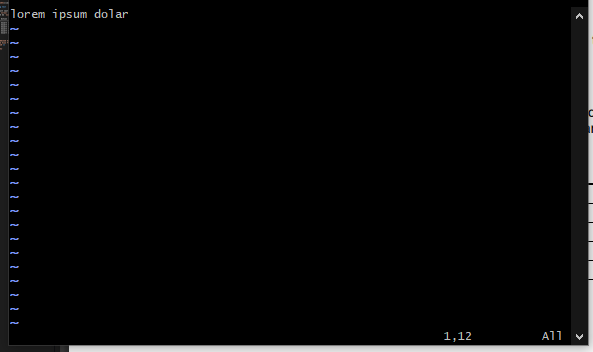
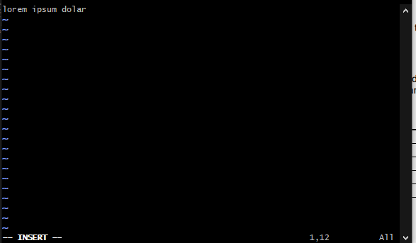
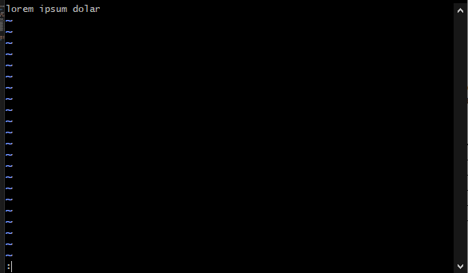
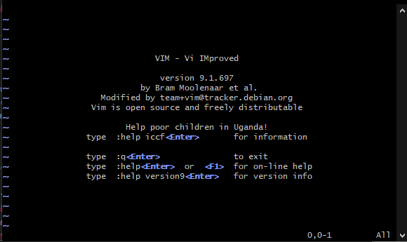
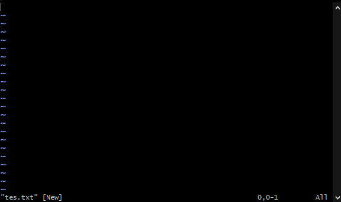

# File Editing with Vim

Vim (Vi Improved) adalah editor teks yang kuat dan fleksibel yang digunakan dalam sistem mirip Unix. Vim dibangun di atas editor Vi asli dengan fitur dan peningkatan tambahan, termasuk pembatalan multi-level, penyorotan sintaksis, dan serangkaian perintah ekstensif untuk manipulasi teks.

## Mode of Operation

Editor `vim` memiliki tiga mode operasi:

- **Normal** (untuk navigasi dan manipulasi)


- **Insert** (untuk editing teks)


- **Command** (untuk menjalankan perintah)


---

## Startting Vim

Editor vim dapat dimulai dengan mengetikkan perintah vim pada perintah prompt, dan mungkin mengikuti nama file yang sudah ada atau nama file baru sebagai argumen. Tanpa nama file tertentu, itu hanya membuka layar kosong di mana Kita bisa memasukkan teks. Kita dapat menyimpan teks dalam file atau membuang menggunakan perintah yang disediakan di subbagian selanjutnya.

```bash
root@server:~# vim
```

Output:



Alternatifnya, Kita dapat memberikan nama file sebagai argumen. Dengan cara ini, vim akan membuka file yang ditentukan untuk diedit jika file tersebut ada, atau  akan membuat file dengan  nama itu jika tidak ada.

```bash
root@server:~# vim tes.txt
```

Output:



## Inserting text

Secara default saat awal dijalankan, editor vim akan masuk dalam `mode normal`. ada enam perintah yang dapat digunakan untuk pindah ke `mode insert`.

| Command | Action                                     |
|---------|--------------------------------------------|
| **i**   | Insert text sebelum posisi kursor saat ini |
| **I**   | Insert text di awal baris saat ini         |
| **a**   | Insert teks setelah posisi kursor saat ini |
| **A**   | Insert teks di akhir baris saat ini        |
| **o**   | Insert baris baru di bawah baris  saat ini |
| **O**   | Insert baris baru di atas baris saat ini   |

---

**Source: `RHCSA® Red Hat® Enterprise Linux® 8 (UPDATED) Training and Exam Preparation Guide, EX200, Edisi Kedua, November 2020`**

`Hal: 136-142`
---
