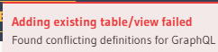
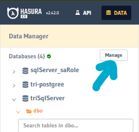
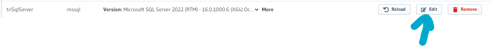
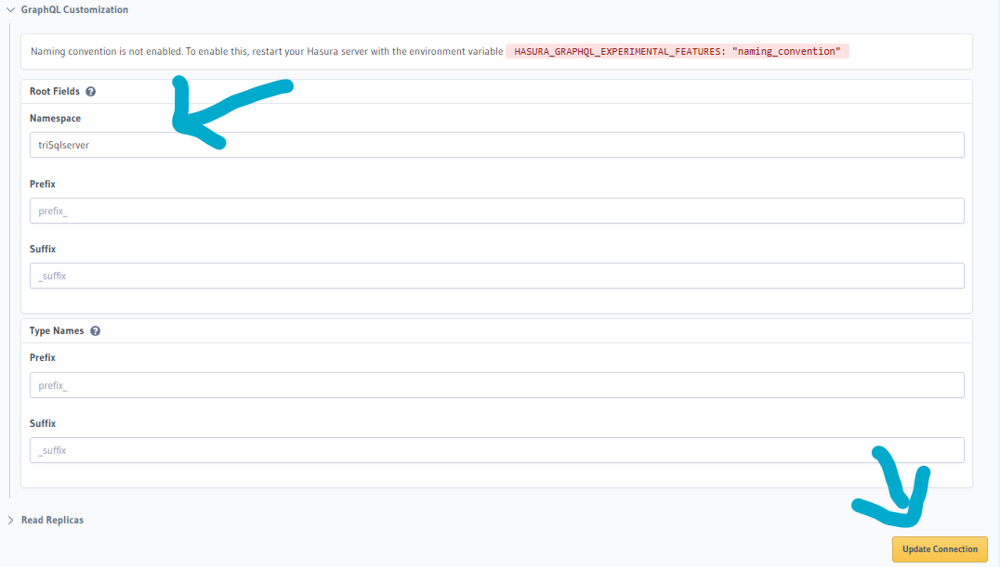
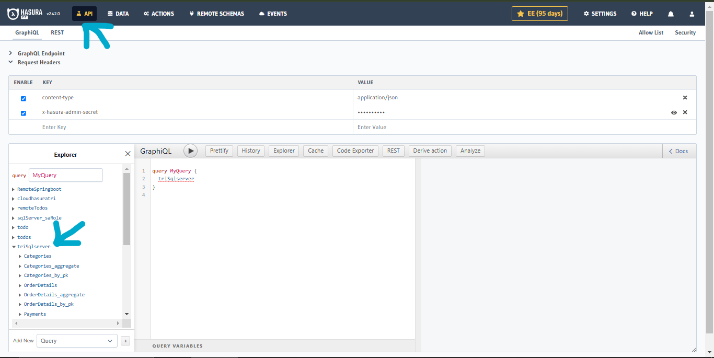

# Dokumentasi Connect SQL SERVER to Hasura V2 via Hasura Console

Dokumen ini menjelaskan langkah-langkah untuk menghubungkan SQL Server ke Hasura GraphQL Engine (v2) menggunakan Hasura Console.

---

## Prasyarat

1. **SQL Server**

   - Server SQL aktif dan dapat diakses.
   - Memilik detail koneksi (host, port, username, password, dan database).
2. **Hasura GraphQL Engine**

   - Hasura GraphQL Engine (v2) sudah berjalan (baik secara lokal, docker, atau pada layanan cloud).
3. **Akses ke Hasura Console**

   - Memiliki akses ke Hasura Console

---

## Langkah-Langkah

### 1. Buka Hasura Console

1. Akses Hasura Console melalui browser dengan alamat URL Hasura `http://IP_adress:port/console`
2. Pastikan masuk dengan kredensial yang benar


---

### 2. Navigasi ke Tab *Data*

1. Di panel navigasi atas, klik tab **Data**.


---

### 3. Tambahkan Database Baru

1. Klik tombol **Connect Database**.
2. Pilih **MSSQL** sebagai tipe database.
3. Klik tombol **Connect Existing Database**.


---

### 4. Masukkan detail koneksi

Isi form dengan detail koneksi SQL Server:

- **Database Display Name**:

  - Nama unik untuk mengenali database ini di Hasura. Misalnya: `triSqlServer`.
- **Connection String**:
  Gunakan format connection string berikut:

  ```
    Driver={ODBC Driver 18 for SQL Server);Server=serveraddress,port;Database=dbname;Uid=username;Pwd=password;Encrypt=optional;
  ```

  

  ---

### 6. Simpan Koneksi

1. Klik tombol **Connect Database**.
2. Jika koneksi berhasil, database akan muncul di daftar database pada tab **Data**.


---

### 7. Fungsi Track pada Database

Setelah koneksi database berhasil, Kita perlu **melacak tabel** (Track Tables) agar Hasura dapat mengakses dan memetakan tabel tersebut ke GraphQL.

#### Apa itu Track?

Fungsi **Track** digunakan untuk:

- Memetakan tabel di database ke dalam skema GraphQL.
- Membuat *query* dan *mutation* GraphQL otomatis untuk tabel yang dilacak.

#### Cara Melacak Tabel:

1. Klik nama database di tab **Data**.
2. Daftar tabel dari database akan ditampilkan.
3. Pilih tabel yang ingin dilacak dengan mengklik tombol **Track** di sebelah nama tabel.
4. Setelah berhasil dilacak, tabel tersebut akan muncul dalam skema GraphQL dan dapat diakses melalui GraphQL API.


#### Menghapus Pelacakan (Untrack):

Jika suatu tabel tidak lagi perlu digunakan di GraphQL, Kita dapat menghapus pelacakan dengan:

1. Klik tombol **Untrack** di sebelah nama tabel.
2. Tabel akan tetap ada di database tetapi tidak akan tersedia di GraphQL API.

---

### 8. Verifikasi Koneksi

1. Klik nama database untuk melihat tabel dan skema yang tersedia.
2. Pastikan tabel yang telah dilacak muncul dalam skema GraphQL di tab **GraphiQL** atau melalui *API endpoint*.

---

## Troubleshooting

- **Tabel Tidak Tampil di Skema GraphQL**:
- Pastikan tabel sudah dilacak menggunakan fungsi **Track**.
- Periksa apakah database Kita memiliki tabel yang memenuhi syarat (misalnya, memiliki kolom primary key atau indeks unik).
- **Track Tables** Failed:



- Pastikan Schema unik.
- Jika schema terdapat kesamaan dengan yang sudah ada;
- Pada tab **Data** klik tombol **manage**



- Pada database klik tombol **edit**



- Pada **GraphQL Customization** edit root dan masukkan string tertentu dan klik **Update Connection**



setelah dilakukan pengeditan root dan track tables, maka pada graphql explore tabel akan tambil didalam **triSqlserver** atau nama lain sesuai yang diisi pada field root.

