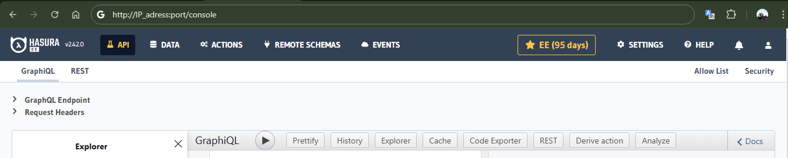
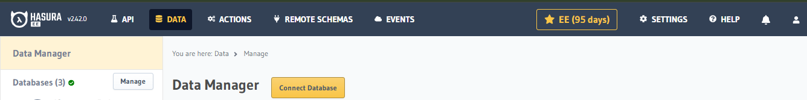
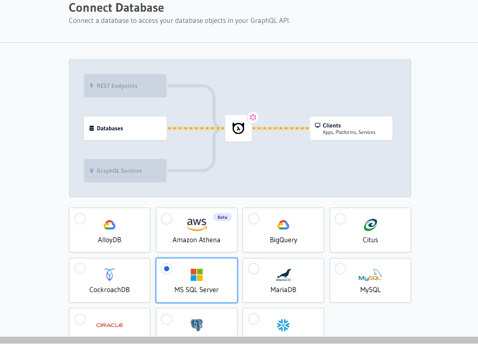
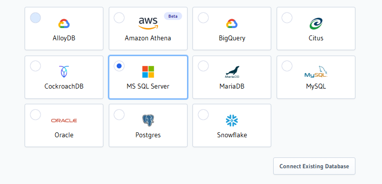
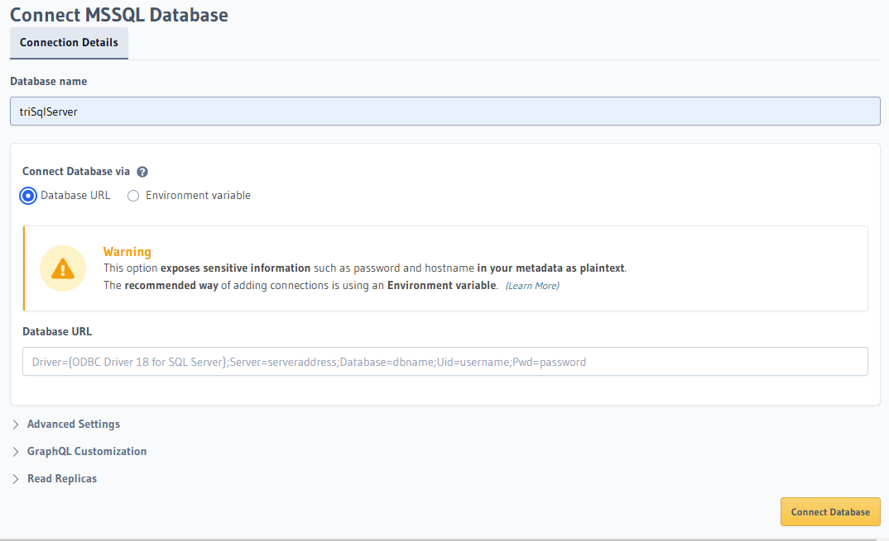
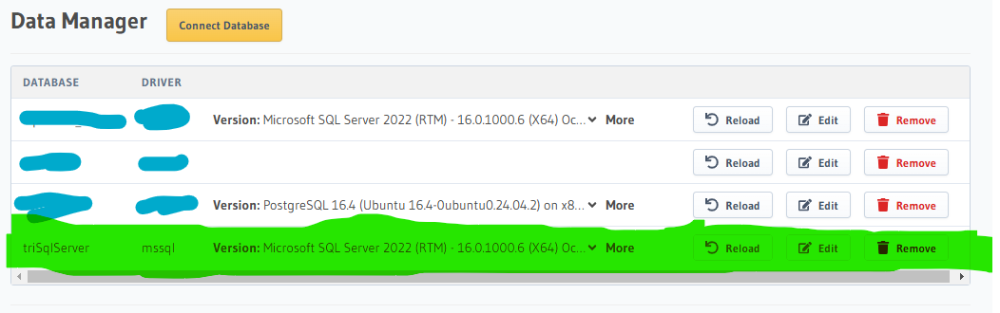

# Dokumentasi Connect SQL SERVER to Hasura V2 via Hasura Console

Dokumen ini menjelaskan langkah-langkah untuk menghubungkan SQL Server ke Hasura GraphQL Engine (v2) menggunakan Hasura Console.

---

## Prasyarat

1. **SQL Server**
    - Server SQL aktif dan dapat diakses.
    - Memilik detail koneksi (host, port, username, password, dan database).

2. **Hasura GraphQL Engine**
    - Hasura GraphQL Engine (v2) sudah berjalan (baik secara lokal, docker, atau pada layanan cloud).

3. **Akses ke Hasura Console**
    - Memiliki akses ke Hasura Console

---

## Langkah-Langkah

### 1. Buka Hasura Console
1. Akses Hasura Console melalui browser dengan alamat URL Hasura `http://IP_adress:port/console`

2. Pastikan masuk dengan kredensial yang benar




---

### 2. Navigasi ke Tab *Data*
1. Di panel navigasi atas, klik tab **Data**.


---

### 3. Tambahkan Database Baru
1. Klik tombol **Connect Database**.
2. Pilih **MSSQL** sebagai tipe database.
3. Klik tombol **Connect Existing Database**.







---

### 4. Masukkan detail koneksi
Isi form dengan detail koneksi SQL Server:

- **Database Display Name**: 
  - Nama unik untuk mengenali database ini di Hasura. Misalnya: `triSqlServer`.

- **Connection String**:
  Gunakan format connection string berikut:

  ```
    Driver={ODBC Driver 18 for SQL Server);Server=serveraddress,port;Database=dbname;Uid=username;Pwd=password;Encrypt=optional;
  ```

  

  ---

### 6. Simpan Koneksi
1. Klik tombol **Connect Database**.
2. Jika koneksi berhasil, database akan muncul di daftar database pada tab **Data**.



---